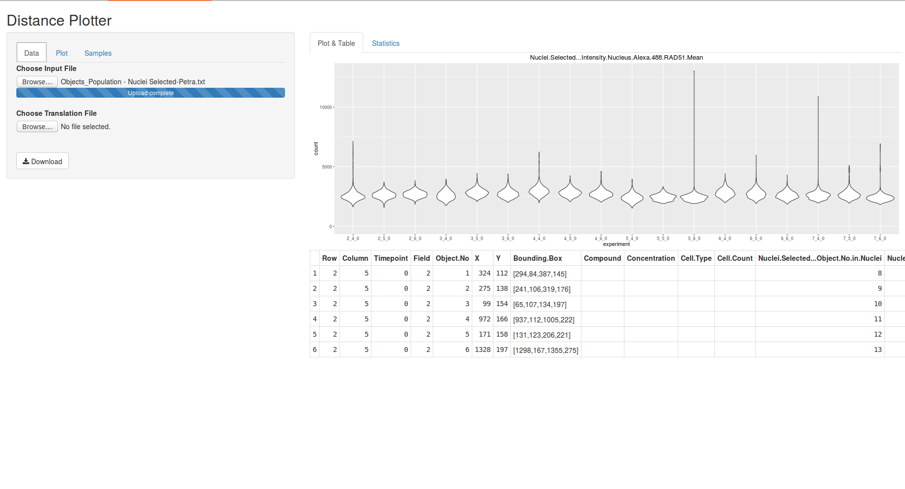

# DistancePlotter #

## Running ##

- create a folder to accomodate DistancePlotter, e.g. PlottingApp
- copy server.R and ui.R into that folder, e.g. PlottingApp or `git clone https://github.com/imbforge/DistancePlotter.git`
- the application can be run either via command line R or Rstudio

### command line R ###
    library(shiny)
    runApp(PlottingApp)

### Rstudio ###
- open either server.R, ui.R or both
- hit "Run App"
- depending on your preferences you can maximise the window into browser

## Usage ##

### Data ###
The "Data" tab is used to open data files and a naming table.

All input files should be saved as TAB delimited files.

#### Data Input file ####

- the file containing the data to be plotted should contain headers
- DistancePlotter will create an "experiment ID" from the 3 columns named "Row", "Column", "Timepoint", e.g. "2_4_0"

    |Row|Column|Timepoint|Field|Object No| ... |
    |---|------|---------|-----|---------|-----|
    |2  |5     |0        |2    |1        | ... |
    |2  |5     |0        |2    |2        | ... |
    |2  |6     |0        |4    |3        | ... |

#### multiple Data Input files ####

- DistancePlotter also digests a folder structure of tab delimited files
- the folder has to be compressed to a zip archive and can be uploaded via the file upload field
- ! Note: as fusion of all input files in the folder may involve a lot of data the process until the plotting area becomes available may take a bit !

#### Naming Input file ####

- a translation table can be used to name experiments according to your wishes instead of raw experiment IDs

    - the file should be TAB delimited
    - the table must contain a header, but the wording is not important
    - first column should contain the "experiment ID", e.g. 2_4_0
    - second column should contain your desired experiment name
    - the order of experiments given in this file will determine the order of experiments plotted

    | old name | real name |
    |----------|-----------|
    |  2_5_0   | treated   |
    |  2_6_0   | untreated |

### Plotting ###
All fields of the "Plot" tab influence the plot shown on the right hand side instantly and can be revised at any time.

- select the type of plot
    - violin plot (a box plot with a rotated kernel density plot on each side.)
    - box plot
    - jitter plot (a box plot showing all data points instead of boxes)
    - density will draw empty areas
    - density (fill) will draw colored areas
    - histogram (stack) will stack all bars
    - histogram (dodge) will print each experiment's bar starting at x-axis
    - all plots can be produced in "coloured" variant, which will paint your samples according to colours chosen in "Sample" tab

- select which column to plot
- select samples to plot ("Samples" tab)

- change the title and y-axis label of the plot, whereas y-axis label will be used as x-axis label for density plots and histograms
- limiting of plotted data and scaling of the y- or x-axis may cause confusion, i.e. log10 scaling with minimal value=0
- select data column for filtering:
    - one column can be selected to filter the plotted data, e.g. to selectively show data of nuclei containing 2 spots, ...
    - if you're happy with the filter settings "Add" the filter 
    - later you can combine several filter settings to your liking
- Download will save the last plot as "plot.pdf"

The "Samples" tab may be used to:

- select samples to plot (each change will reset this tab including color choices)
- select which colour the samples are plotted in - default colour is white

### Statistics ###

- ! Note: don't get nervous, if no statistics is shown immediately. It takes a bit... !
- DistancePlotter will calculate Mann-Whitney (aka Wilcoxon) test on all data selected by the chosen column to plot
- a matrix of all vs. all will be shown and can be downloaded as csv (comma separated file)

